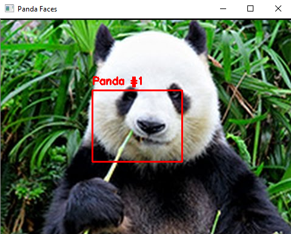
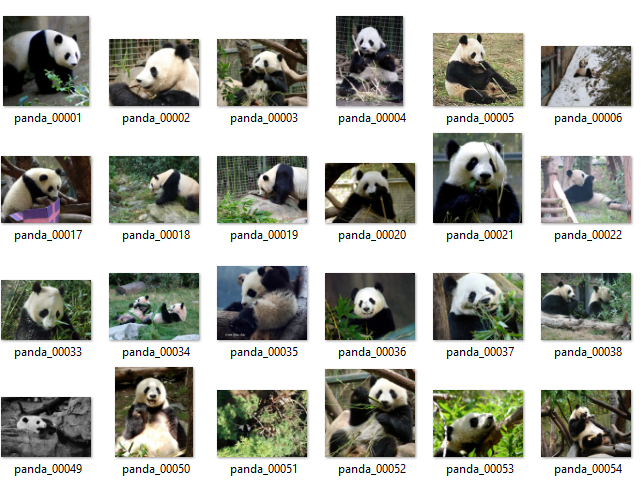
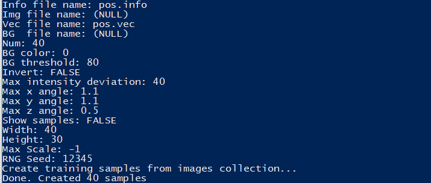
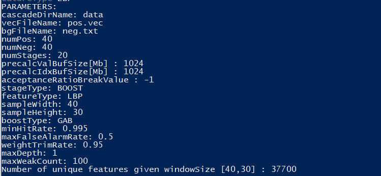
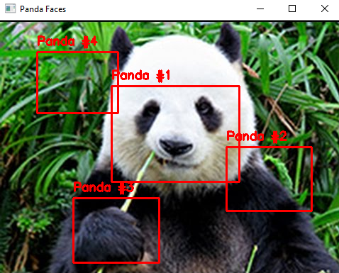

# Cascade-Pandas-Classifier
Let's find pandas using opencv, training a cascading classifier.

OpenCV is a free library of artificial vision, there are several applications of this library, this time I want to show you how I could also use it to find pandas.

# Process
- Pandas image data set
- Train our pandas classifier
- Find the panda

# Pandas image data set
Although this part may take time, to our luck, I told you that I found a dataset that we could use, where there are photographs of dogs, cats and pandas.

It is from kaggle and you can find it in the following url 
* https://www.kaggle.com/ashishsaxena2209/animal-image-datasetdog-cat-and-panda

# Train our pandas classifier
We already have the images with which we can work, now comes the fun part, which is to train our classifier of pandas.

Before starting the process I tell you that you can find the following information in more detail, at the following link, which takes you to the OpenCV tutorials
* https://docs.opencv.org/master/dc/d88/tutorial_traincascade.html

Object detection using Haar's feature-based cascade classifiers is an effective object detection method proposed by Paul Viola and Michael Jones in their article, "Rapid Object Detection Using an Improved Simple Feature Cascade" in 2001.

So I wanted to invite you to review the theory, which will help us understand how Haar's cascading object detection works.
* https://docs.opencv.org/3.4/db/d28/tutorial_cascade_classifier.html

# What do we do with our images?
Taking as a guide the tutorial that I left above, we will need a set of positive and negative samples, I wanted you to know that this process, I did it manually and with the help of the code that I wrote mainly for it.

# Negative?
Negative samples are taken from arbitrary images, which do not contain objects that you want to detect. These negative images, from which the samples are generated, must appear in a special negative image file that contains one image path per line (can be absolute or relative).

# Positive?
Collection of previously marked images (focusing on what we want to recognize), I did this part manually (cropping images). This collection is described using a text file similar to the background description file. Each line in this file corresponds to an image. The first item on the line is the file name, followed by the number of object annotations, followed by numbers that describe the coordinates of the objects that delimit rectangles (x, y, width, height).

# Details 
Within this repository, in order to make the process a little easier if you do not think of any tool that is recommended in the tutorial that leaves lines above, you can use the following files that I made.
* generate_neg_info.py
* generate_pos_info.py

If you take into account the order found in this repository, you will have no problem having the files that correspond to your positive and negative samples.
* neg.txt
* pos.info

But in order to train our cascade classifier to detect pandas, our file must have a pos.vec, we will create this file using OpenCV from our pos.info.

# opencv_createsamples
* num: number of objects we have.
* w, h: width and height of the training data we want to create.

Command in windows
* ./opencv_createsamples -info pos.info -num 40 -w 150 -h 200 -vec pos.vec

# Training time
In this part we already have our files to start cascade training.

# opencv_traincascade
* data: if a data folder is supplied, which must be created manually beforehand, the output of the stage will be stored
* vec: our pos.vec file
* bg: our file neg.txt
* numPos: number of positive samples
* numNeg: Number of negative samples

Command in windows
* ./opencv_traincascade -data data -vec pos.vec -bg neg.txt -numPos 40 -numNeg 40 -numStage 10 -w 150 -h 200 -featureType LBP

# And now?
If we go to the "data" folder we can find our cascade.xml

What a thrill !!!

# We will use it
I will create a folder called "test" and inside I will leave my file cascade.xml and I will leave you my file called detect.py where you can test with the panda.png image that I took from the internet.

Command in windows
* python detect.py -i "panda.jpg" -c "cascade.xml"

# What happened?
As you may have seen, we managed to have a first version, with a limited number of images without using the total, also choose to reduce the dimensions of the images in training, due to hardware limits, this and other factors greatly influence the result :3

# Whats Next?
With a little more time, use of the tools recommended in the OpenCV tutorial, also a wider use of images and with better resources we could have better results.

Before closing with this small contribution I leave you in the "test" folder the file "cascade_v2.xml" a version that behaves better with the image we have: 3

## Credits
This project would not be possible without:
- https://www.python.org/
- https://github.com/opencv/opencv
- https://pillow.readthedocs.io/en/stable/
- https://www.kaggle.com/ashishsaxena2209/animal-image-datasetdog-cat-and-panda
